### Sin

Sin exerts effects on the world that suggest it is almost a self-contained entity, but ultimately, it is not. Sin is rogue agency presenting as authentic reality while pseudo-symbiotically self-usurping its host. Sin conscripts into a corrupted rebellion against God, self, and other creatures. Sin's seductive sedition can neither succeed nor cease, even when nothing remains but the irretrievably abominable self in perpetuity. Sin cannot be remedied. But breathing souls can be rescued, redeemed, and reconstructed by blood, by water, and by the Holy Spirit. Like unclean spirits expelled to dry places, sin seeks to resist remission and reclaim the vessel it once controlled. By Holy Spirit’s power, the willing overcome; the unwilling are overrun. Sin is dangerous but defeatable, never to be feared, always to be resisted, and never to be underestimated.

Beyond being a corrupting pseudo-force, sin is also the name for thoughts, communication, activities, and decisions contrary to what the self knows to be good, lawful, and faithful. All good things originate with the Lord, so even people who have not received scriptural revelation are unknowingly aligning themselves with the Lord when they choose what is good. 

Sin originates at the willful departure of any creature from the Living God. The corruptive effects of sin on the biosphere, causal effects on history, or judicial ramifications upon a group membership can be inherited. The guilt, indebtedness, or individual liability of sin cannot be inherited. Adam’s sin doomed the flesh of all his descendants to corruption of the physical livelihood of material bodies and natural dispositions of thier souls. Through Adam, every instance of Adamic life will naturally end at least once. However, the breath of God, which gives life to all, is not of Adam’s seed but is the light that enlightens every person conceived in the world. 

It is personal sin that necessitates being born again. Personal sin severs the functional connection between the human soul and its original spirit, rendering the person dead in trespasses and sins to healthy spiritual functionality. The remedy for this psychopneumatic death is the impartation of a new spirit by the Father’s breath, creating a renewed human spirit. This spiritual rebirth accounts for regaining functionality innate to the human spirit but does nothing for the soulical corruption caused by sin or the eternal debt incurred from sinning.  The payout of the debt of personal sin is dimensional exile to a place fit to suffer the eternal judicial sentencing attached to that or many sins. 

It is impossible to catalog every act that might constitute sin in all places and all times. Nevertheless, scripture provides hundreds of named transgressions, many of which extend beyond the localized contexts of Sinai, Jerusalem, or Galilee. Just as Jesus shows that hate is murder and that extramarital mental fantasizing is still committing adultery, we learn that the concepts of the letter and the spirit of the letter are profoundly significant both within and beyond the letter of the word.

It is possible to sum up primary root themes that provide a helpful compass for navigating sin's tangled forest of corrupted fruit. Despite not being comprehensive, any student of the word may still find assistance.

Nearly all sin is some form or blend of malice, idolatry, treachery, or exploitation. These four categories provide interpretive clarity. They offer diagnostic value: “Am I being malicious?” “Is activity idolatrous?” “Am I betraying a trust?” “Am I unjustly exploiting a person or opportunity?” Among several potential benefits, this kind of moral taxonomy creates a kind of spiritual system of checks and balances. It allows the student of scripture to trace unseen connections between sins through enlisting the bright spots in our personal experience to shed light on blind spots we didn't know were related. Understanding the structure of sin, even imperfectly, sharpens our capacity to resist it faithfully.

#### Hermeneutical Disclaimer:

This analysis proceeds on the methodological assumption that theology must arise traceably from exegesis of the text. All readings and conclusions must respect immediate literary and historical context while additionally being apt to consider wider material from the given book and canon as applicable. Systematic theology, interpretive tradition, naming conventions, science, archaeology, and philosophy possess intrinsic value as disciplines. Use of these disciplines must not override textual content that is explicitly stated or cogently inferable or import semiotic artifacts untenably foreign to its original information environment. Interpretive lenses are necessarily embedded in any interpretive operation of scripture but must not weigh in at the expense of the text’s self-defined logos, ethos, or pathos.

## MITE Framework

The M.I.T.E. (Malice, Idolatry, Treachery, Exploitation) Hamartiology Taxonomy is a comprehensive categorization of sins, each reflecting a particular aspect of human failings and moral shortcomings from a Christian theological perspective. Here's an analysis of each category:

Malice

Rooted in hate and hostility, malice represents actions and attitudes that directly harm others or intend to do so. Biblically, this is condemned in numerous passages (e.g., Romans 1:29, Ephesians 4:31).
Subcategories like mercilessness, murder, discrimination, and cruelty are explicitly rebuked in scripture (e.g., 1 John 3:15, James 2:13).
Discord, as a subcategory, encapsulates behaviors that disrupt unity and peace, contrary to the Biblical exhortation for harmony (Romans 12:16-18, 1 Corinthians 1:10).
Vengeance contradicts the Biblical teaching that vengeance belongs to God, and humans are called to forgive (Romans 12:19, Matthew 6:15).
Apathy, especially indifference and neglect, is contrary to the Christian call to love and care for others (1 John 3:17-18).
Idolatry

This category encompasses sins that place something or someone in the position of God in one's life, directly violating the first of the Ten Commandments (Exodus 20:3).
Perversion, including sexual immorality and unnatural desires, is frequently condemned in the Bible (1 Corinthians 6:9-10, Romans 1:26-27).
Lust, in its many forms, is a sin against one’s own body and against God, who calls for purity (Matthew 5:28, 1 Corinthians 6:18).
Witchcraft and related practices are considered rebellion against God (Deuteronomy 18:10-12, Galatians 5:19-21).
Avarice, or extreme greed, is idolatry as it puts material wealth before God (Colossians 3:5, 1 Timothy 6:10).
Treachery

This category deals with betrayal and deception, actions condemned throughout the Bible.
Deception, including lying and false witness, is contrary to God’s nature of truth (Proverbs 12:22, Ephesians 4:25).
Breach, such as adultery and disloyalty, undermines trust and covenants, both human and divine (Exodus 20:14, Hebrews 13:4).
Theft, in any form, is directly prohibited by the Ten Commandments (Exodus 20:15) and is considered an injustice to others.
Exploitation

This category focuses on the misuse of power and authority to take advantage of others.
Oppression, including injustice and abuse, is against the Biblical call to justice and care for the marginalized (Isaiah 1:17, James 2:6).
Merchandising, in the sense of exploiting others for personal gain, is condemned (2 Peter 2:3, Matthew 21:12-13).
Control, through coercion or manipulation, is contrary to the Biblical principle of freedom in Christ and the call to serve others in love (Galatians 5:13, 2 Corinthians 1:24).

#### **Malice**

Sinful expressions that manifest hostility, harm, or indifference toward others.

* **Hatred** – Defined as equivalent to murder in motive and consequence (1 John 3:15).
* **Bitterness** – A root that defiles many and resists grace (Hebrews 12:15).
* **Wrath and Rage** – Human anger does not produce righteousness (James 1:20; Ephesians 4:31).
* **Discord** – Those who cause divisions oppose apostolic exhortation (Romans 16:17).
* **Apathy** – Indifference toward the things of God invites rebuke (Revelation 3:15-16).
* **Mercilessness** – Those who show no mercy will receive none (Matthew 18:33).
* **Murder** – Violates the explicit command of God (Exodus 20:13).
* **Discrimination and Cruelty** – Partiality and harshness violate God's justice (Leviticus 19:15; Proverbs 11:17).
* **Vengeance** – Belongs to God alone; humans are called to forgive (Romans 12:19).

---

#### **Idolatry**

The elevation of anything above or in place of God.

* **Blasphemy** – Speaking against the Holy Spirit carries grave warning (Mark 3:29).
* **Lust** – A consuming desire that defiles (1 Thessalonians 4:5).
* **Materialism and Greed** – Rooted in idolatry, these enslave the heart (1 Timothy 6:10; Luke 12:15).
* **Avarice** – An excessive love of gain condemned in spiritual leadership (Luke 12:15).
* **Divination and Witchcraft** – Rejected as rebellion and spiritual treason (Galatians 5:20; Acts 16:16–18).
* **Iconolatry** – Worshiping created images misrepresents God (Acts 17:29).
* **Hedonism and Gluttony** – Pleasure-seeking that leads away from spiritual sobriety (Ecclesiastes 2:1; Philippians 3:19).
* **Sexual Immorality** – Includes adultery, fornication, lechery, and promiscuity, all of which violate God's sexual design (Matthew 5:28; 1 Corinthians 6:18; Jeremiah 5:8; Proverbs 7:10–12).

---

#### **Treachery**

Betrayals and deceptions that break trust and fracture relationships.

* **Deception and Lying** – Corrupt and distort the truth, undermining righteousness (2 Timothy 3:13; Colossians 3:9).
* **False Witness and Slander** – Condemned as abominations and injustice (Revelation 21:8; James 4:11).
* **Gossip and Disparagement** – Erode community and integrity (2 Corinthians 12:20; Psalm 15:3).
* **Breach and Covenant Breaking** – Violations of sacred and human bonds (James 2:10; Ezekiel 16:59).
* **Backstabbing and Dishonesty** – Betrayal of close relations and the trust of community (Psalm 41:9; Colossians 3:9).
* **Theft** – A direct affront to justice and stewardship (Ephesians 4:28).

---

#### **Exploitation**

The abuse or misuse of people, power, or position for unjust gain.

* **Oppression** – A grave offense against God’s concern for the vulnerable (James 5:4).
* **Manipulation** – Misleading others for control or personal advantage (2 Corinthians 4:2).
* **Merchandising** – Exploiting spiritual things or people for profit (2 Peter 2:3).
* **Control and Coercion** – Power used to dominate rather than serve (3 John 1:9; 1 Peter 5:2–3).
* **Misappropriation and Utilization** – Diverting or using resources or persons unjustly (Luke 16:1–2; Proverbs 14:31).
* **Cheating and Capitalization** – Gaining through unfair advantage (1 Thessalonians 4:6; James 5:1–6).
* **Blackmail** – Using threats or leverage to coerce others unjustly (Deuteronomy 24:17).

---

In summary, the M.I.T.E. taxonomy provides a detailed and expansive view of sin, encompassing a wide range of human behaviors and attitudes that are contrary to the teachings and character of God as revealed in the Bible. This taxonomy highlights the need for human beings to seek redemption and transformation through Christ, recognizing the pervasive nature of sin in every aspect of human life and society.

```mermaid
---
config:
  layout: elk
  theme: neo-dark
---
flowchart RL
Apostasy["`Apostasy
2 Thess 2:3`"]
Abandonment["`Abandonment
2 Tim 4:10`"]
Neglect["`Neglect
1 Tim 5:8`"]
Apathy["`Apathy
Rev 3:15-16`"]
Callousness["`Callousness
Eph 4:18-19`"]
Pride["`Pride
1 John 2:16`"]
Arrogance["`Arrogance
Rom 1:30`"]
Bribery_Accepting["`Bribery Accepting
Acts 8:18-20`"]
Avarice["`Avarice
Luke 12:15`"]
Embezzlement["`Embezzlement
John 12:6`"]
Extortion["`Extortion
Luke 3:13-14`"]
Usury["`Usury
Exod 22:25`"]
Profanation["`Profanation
Lev 19:12`"]
Blasphemy["`Blasphemy
Mark 3:29`"]
Sacrilege["`Sacrilege
Mal 3:8`"]
Breach["`Breach
James 2:10`"]
Backstabbing["`Backstabbing
Ps 41:9`"]
Covenant_Breaking["`Covenant Breaking
Ezek 16:59`"]
Dishonesty["`Dishonesty
Col 3:9`"]
Coercion["`Coercion
1 Pet 5:2-3`"]
Utilization["`Utilization
Prov 14:31`"]
Adultery["`Adultery
Matt 5:28`"]
Lechery["`Lechery
Jer 5:8`"]
Promiscuity["`Promiscuity
Prov 7:10-12`"]
Fornication["`Fornication
1 Cor 6:18`"]
False_Witness["`False Witness
Rev 21:8`"]
Deception["`Deception
2 Tim 3:13`"]
Lying["`Lying
Col 3:9`"]
Slander["`Slander
James 4:11`"]
Quarreling["`Quarreling
2 Tim 2:23`"]
Contention["`Contention
Titus 3:9`"]
Dissension["`Dissension
Gal 5:20`"]
Discord["`Discord
Rom 16:17`"]
Mutiny["`Mutiny
Num 16:1-3`"]
Rivalry["`Rivalry
Phil 2:3`"]
Theft["`Theft
Eph 4:28`"]
Defamation["`Defamation
1 Pet 2:1`"]
Gossip["`Gossip
2 Cor 12:20`"]
Disparagement["`Disparagement
Ps 15:3`"]
Astrology["`Astrology
Isa 47:13`"]
Divination["`Divination
Acts 16:16-18`"]
Witchcraft["`Witchcraft
Gal 5:20`"]
Channeling["`Channeling
Lev 19:31`"]
Mysticism["`Mysticism
Deut 29:29`"]
Manipulation["`Manipulation
2 Cor 4:2`"]
Merchandising["`Merchandising
2 Pet 2:3`"]
Oppression["`Oppression
James 5:4`"]
Greed["`Greed
Luke 12:15`"]
Cheating["`Cheating
1 Thess 4:6`"]
Covetousness["`Covetousness
Eph 5:5`"]
Unforgiveness["`Unforgiveness
Matt 6:15`"]
Hardheartedness["`Hardheartedness
Heb 3:13`"]
Hatred["`Hatred
1 John 3:15`"]
Envy["`Envy
James 3:16`"]
Partiality["`Partiality
James 2:1`"]
Mercilessness["`Mercilessness
Matt 18:33`"]
Cruelty["`Cruelty
Prov 11:17`"]
Discrimination["`Discrimination
Lev 19:15`"]
Debauchery["`Debauchery
Rom 13:13`"]
Gluttony["`Gluttony
Phil 3:19`"]
Idolizing["`Idolizing
1 John 5:21`"]
Iconolatry["`Iconolatry
Acts 17:29`"]
Lust["`Lust
1 Thess 4:5`"]
Materialism["`Materialism
1 Tim 6:10`"]
Hedonism["`Hedonism
Eccl 2:1`"]
Treachery["`Treachery
2 Tim 3:4`"]
Rage["`Rage
Eph 4:31`"]
Vengeance["`Vengeance
Rom 12:19`"]
Bribery_Giving["`Bribery Giving
Exod 23:8`"]
Blackmail["`Blackmail
Deut 24:17`"]
Gaslighting["`Gaslighting
Prov 26:24-26`"]
Capitalization["`Capitalization
James 5:1-6`"]
Double_dealing["`Double dealing
Ps 12:2`"]
Swindling["`Swindling
1 Cor 6:10`"]
Seance["`Seance
Deut 18:10-11`"]
Necromancy["`Necromancy
Deut 18:11`"]
Control["`Control
3 John 1:9`"]
Inequity["`Inequity
James 2:9`"]
Injustice["`Injustice
Luke 18:7`"]
Abuse["`Abuse
Ps 10:7`"]
Prejudice["`Prejudice
James 2:9`"]
Narcissism["`Narcissism
2 Tim 3:2`"]
Vanity["`Vanity
2 Pet 2:18`"]
Trolling["`Trolling
Prov 26:18-19`"]
Wrath["`Wrath
James 1:20`"]
Rebellion["`Rebellion
2 Tim 3:2`"]
Enslavement["`Enslavement
Gal 5:1`"]
Subjugation["`Subjugation
1 Pet 5:3`"]
Misappropriation["`Misappropriation
Luke 16:1-2`"]
Sorcery["`Sorcery
Acts 8:11`"]
Wicca["`Wicca
Deut 18:10-12`"]
Malice["`Malice
Col 3:8`"]
Sin["`Sin
Iniquity
1 John 3:4`"]
Murder["`Murder
Exod 20:13`"]
Idleness["`Idleness
Prov 19:15`"]
Cowardice["`Cowardice
Rev 21:8`"]
Bitterness["`Bitterness
Heb 12:15`"]
Unrepentance["`Unrepentance
Romans 2:5`"]

Unrepentance -- Form_of --> Hardheartedness
Unrepentance -. Act_Of .-> Rebellion
Unrepentance -. Para-Intentional .-> Exploitation
Unrepentance -. Para-Intentional .-> Treachery
Gaslighting -- Form_of --> Deception
Bitterness -- Form_of --> Malice
Cowardice -- Form_of --> Abandonment
Cowardice -. Act_Of .-> Treachery
Apostasy -- Form_of --> Abandonment
Neglect -- Form_of --> Apathy
Callousness -- Form_of --> Apathy
Pride -- Form_of --> Arrogance
Bribery_Accepting -- Form_of --> Avarice
Embezzlement -- Form_of --> Avarice
Extortion -- Form_of --> Avarice
Usury -- Form_of --> Avarice
Profanation -- Form_of --> Blasphemy
Sacrilege -- Form_of --> Blasphemy
Abandonment -- Form_of --> Breach
Backstabbing -- Form_of --> Breach
Covenant_Breaking -- Form_of --> Breach
Dishonesty -- Form_of --> Breach
Extortion -. Act_Of .-> Coercion
Utilization -- Form_of --> Coercion
Adultery -- Form_of --> Covenant_Breaking
Lechery -- Form_of --> Debauchery
Promiscuity -- Form_of --> Debauchery
Fornication -- Form_of --> Debauchery
False_Witness -- Form_of --> Deception
Lying -- Form_of --> Deception
Slander -. Act_Of .-> Deception
Quarreling -- Form_of --> Contention
Dissension -- Form_of --> Discord
Contention -- Form_of --> Discord
Mutiny -- Form_of --> Discord
Rivalry -- Form_of --> Dissension
Theft -- Form_of --> Dishonesty
Defamation -- Form_of --> Slander
Gossip -- Form_of --> Disparagement
Slander -- Form_of --> Disparagement
Astrology -- Form_of --> Divination
Witchcraft -- Form_of --> Divination
Channeling -- Form_of --> Divination
Mysticism -- Form_of --> Divination
Manipulation -- Form_of --> Control
Manipulation -. Para-Intentional .-> Control

Merchandising -- Form_of --> Exploitation
Oppression -- Form_of --> Exploitation
Usury -- Form_of --> Merchandising
Adultery -. Act_Of .-> Fornication
Avarice -- Form_of --> Greed
Cheating -- Form_of --> Greed
Covetousness -- Form_of --> Greed
Unforgiveness -- Form_of --> Hardheartedness
Adultery -. Para-Intentional .-> Hatred
Envy -- Form_of --> Hatred
Partiality -- Form_of --> Hatred
Mercilessness -- Form_of --> Hatred
Cruelty -- Form_of --> Hatred
Discrimination -- Form_of --> Hatred
Debauchery -- Form_of --> Hedonism
Gluttony -- Form_of --> Hedonism
Idolizing -- Form_of --> Iconolatry
Blasphemy -- Form_of --> Idolatry
Blasphemy -. Act_Of .-> Idolatry
Divination -- Form_of --> Idolatry
Greed -- Form_of --> Idolatry
Iconolatry -- Form_of --> Divination
Lust -- Form_of --> Idolatry
Witchcraft -- Form_of --> Idolatry
Materialism -. Act_Of .-> Idolizing
Materialism -- Form_of --> Lust
Hedonism -- Form_of --> Lust
Pride -- Form_of --> Lust
Disparagement -- Form_of --> Treachery
Hardheartedness -- Form_of --> Bitterness
Hatred -- Form_of --> Malice
Rage -- Form_of --> Vengeance
Discord -- Form_of --> Malice
Apathy -- Form_of --> Malice
Bribery_Giving -- Form_of --> Manipulation
Blackmail -- Form_of --> Manipulation
Gaslighting -- Form_of --> Manipulation
Coercion -- Form_of --> Manipulation
Capitalization -- Form_of --> Merchandising
Discrimination -- Form_of --> Merchandising
Double_dealing -- Form_of --> Misappropriation
Swindling -- Form_of --> Misappropriation
Seance -- Form_of --> Necromancy
Control -- Form_of --> Oppression
Inequity -- Form_of --> Oppression
Injustice -- Form_of --> Oppression
Theft -- Form_of --> Exploitation
Abuse -- Form_of --> Cruelty
Prejudice -- Form_of --> Partiality
Narcissism -- Form_of --> Pride
Arrogance -- Form_of --> Pride
Vanity -- Form_of --> Pride
Trolling -- Form_of --> Quarreling
Wrath -- Form_of --> Vengeance
Apostasy -. Act_Of .-> Rebellion
Enslavement -- Form_of --> Subjugation
Breach -- Form_of --> Treachery
Deception -- Form_of --> Treachery
Vengeance -- Form_of --> Unforgiveness
Necromancy -- Form_of --> Witchcraft
Sorcery -- Form_of --> Witchcraft
Rebellion -- Form_of --> Witchcraft
Wicca -- Form_of --> Witchcraft
Channeling -. Act_Of .-> Witchcraft
Murder -- Form_of --> Vengeance
Theft -- Form_of --> Treachery
Control -- Form_of --> Exploitation
Malice -- Form_of --> Sin
Idolatry -- Form_of --> Sin
Treachery -- Form_of --> Sin
Exploitation -- Form_of --> Sin
Misappropriation -- Form_of --> Theft
Subjugation -- Form_of --> Oppression
Adultery -. Para-Intentional .-> Abandonment
```

