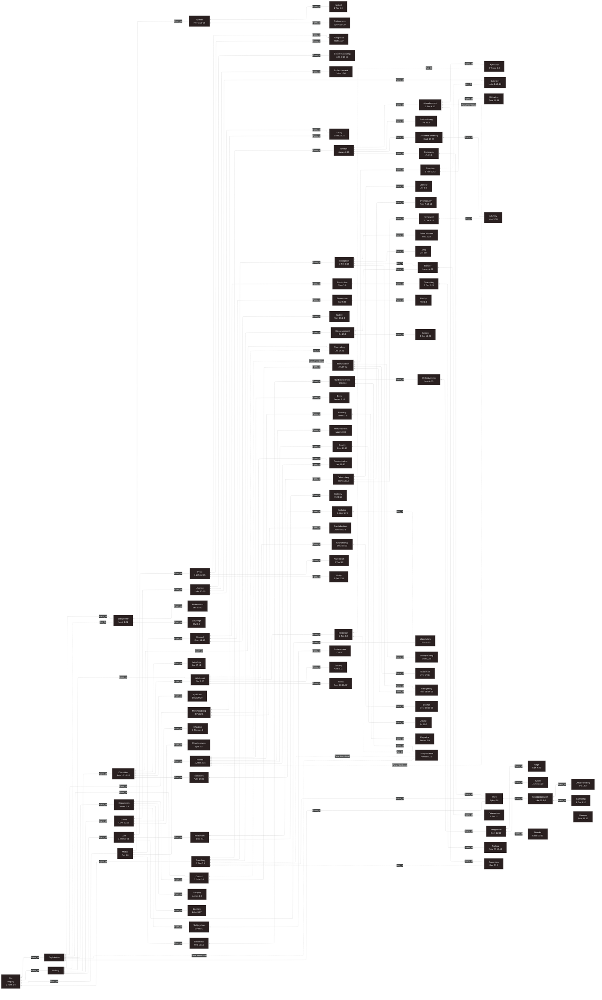

```mermaid
---
config:
  layout: elk
  theme: neo-dark
---
flowchart RL
Apostasy["`Apostasy
2 Thess 2:3`"]
Abandonment["`Abandonment
2 Tim 4:10`"]
Neglect["`Neglect
1 Tim 5:8`"]
Apathy["`Apathy
Rev 3:15-16`"]
Callousness["`Callousness
Eph 4:18-19`"]
Pride["`Pride
1 John 2:16`"]
Arrogance["`Arrogance
Rom 1:30`"]
Bribery_Accepting["`Bribery Accepting
Acts 8:18-20`"]
Avarice["`Avarice
Luke 12:15`"]
Embezzlement["`Embezzlement
John 12:6`"]
Extortion["`Extortion
Luke 3:13-14`"]
Usury["`Usury
Exod 22:25`"]
Profanation["`Profanation
Lev 19:12`"]
Blasphemy["`Blasphemy
Mark 3:29`"]
Sacrilege["`Sacrilege
Mal 3:8`"]
Breach["`Breach
James 2:10`"]
Backstabbing["`Backstabbing
Ps 41:9`"]
Covenant_Breaking["`Covenant Breaking
Ezek 16:59`"]
Dishonesty["`Dishonesty
Col 3:9`"]
Coercion["`Coercion
1 Pet 5:2-3`"]
Utilization["`Utilization
Prov 14:31`"]
Adultery["`Adultery
Matt 5:28`"]
Lechery["`Lechery
Jer 5:8`"]
Promiscuity["`Promiscuity
Prov 7:10-12`"]
Fornication["`Fornication
1 Cor 6:18`"]
False_Witness["`False Witness
Rev 21:8`"]
Deception["`Deception
2 Tim 3:13`"]
Lying["`Lying
Col 3:9`"]
Slander["`Slander
James 4:11`"]
Quarreling["`Quarreling
2 Tim 2:23`"]
Contention["`Contention
Titus 3:9`"]
Dissension["`Dissension
Gal 5:20`"]
Discord["`Discord
Rom 16:17`"]
Mutiny["`Mutiny
Num 16:1-3`"]
Rivalry["`Rivalry
Phil 2:3`"]
Theft["`Theft
Eph 4:28`"]
Defamation["`Defamation
1 Pet 2:1`"]
Gossip["`Gossip
2 Cor 12:20`"]
Disparagement["`Disparagement
Ps 15:3`"]
Astrology["`Astrology
Isa 47:13`"]
Divination["`Divination
Acts 16:16-18`"]
Witchcraft["`Witchcraft
Gal 5:20`"]
Channeling["`Channeling
Lev 19:31`"]
Mysticism["`Mysticism
Deut 29:29`"]
Manipulation["`Manipulation
2 Cor 4:2`"]
Merchandising["`Merchandising
2 Pet 2:3`"]
Oppression["`Oppression
James 5:4`"]
Greed["`Greed
Luke 12:15`"]
Cheating["`Cheating
1 Thess 4:6`"]
Covetousness["`Covetousness
Eph 5:5`"]
Unforgiveness["`Unforgiveness
Matt 6:15`"]
Hardheartedness["`Hardheartedness
Heb 3:13`"]
Hatred["`Hatred
1 John 3:15`"]
Envy["`Envy
James 3:16`"]
Partiality["`Partiality
James 2:1`"]
Mercilessness["`Mercilessness
Matt 18:33`"]
Cruelty["`Cruelty
Prov 11:17`"]
Discrimination["`Discrimination
Lev 19:15`"]
Debauchery["`Debauchery
Rom 13:13`"]
Gluttony["`Gluttony
Phil 3:19`"]
Idolizing["`Idolizing
1 John 5:21`"]
Iconolatry["`Iconolatry
Acts 17:29`"]
Lust["`Lust
1 Thess 4:5`"]
Materialism["`Materialism
1 Tim 6:10`"]
Hedonism["`Hedonism
Eccl 2:1`"]
Treachery["`Treachery
2 Tim 3:4`"]
Rage["`Rage
Eph 4:31`"]
Vengeance["`Vengeance
Rom 12:19`"]
Bribery_Giving["`Bribery Giving
Exod 23:8`"]
Blackmail["`Blackmail
Deut 24:17`"]
Gaslighting["`Gaslighting
Prov 26:24-26`"]
Capitalization["`Capitalization
James 5:1-6`"]
Double_dealing["`Double dealing
Ps 12:2`"]
Swindling["`Swindling
1 Cor 6:10`"]
Seance["`Seance
Deut 18:10-11`"]
Necromancy["`Necromancy
Deut 18:11`"]
Control["`Control
3 John 1:9`"]
Inequity["`Inequity
James 2:9`"]
Injustice["`Injustice
Luke 18:7`"]
Abuse["`Abuse
Ps 10:7`"]
Prejudice["`Prejudice
James 2:9`"]
Narcissism["`Narcissism
2 Tim 3:2`"]
Vanity["`Vanity
2 Pet 2:18`"]
Trolling["`Trolling
Prov 26:18-19`"]
Wrath["`Wrath
James 1:20`"]
Rebellion["`Rebellion
2 Tim 3:2`"]
Enslavement["`Enslavement
Gal 5:1`"]
Subjugation["`Subjugation
1 Pet 5:3`"]
Misappropriation["`Misappropriation
Luke 16:1-2`"]
Sorcery["`Sorcery
Acts 8:11`"]
Wicca["`Wicca
Deut 18:10-12`"]
Malice["`Malice
Col 3:8`"]
Sin["`Sin
Iniquity
1 John 3:4`"]
Murder["`Murder
Exod 20:13`"]
Idleness["`Idleness
Prov 19:15`"]
Cowardice["`Cowardice
Rev 21:8`"]
Bitterness["`Bitterness
Heb 12:15`"]
Unrepentance["`Unrepentance
Romans 2:5`"]

Unrepentance -- Form_of --> Hardheartedness
Unrepentance -. Act_Of .-> Rebellion
Unrepentance -. Para-Intentional .-> Exploitation
Unrepentance -. Para-Intentional .-> Treachery
Gaslighting -- Form_of --> Deception
Bitterness -- Form_of --> Malice
Cowardice -- Form_of --> Abandonment
Cowardice -. Act_Of .-> Treachery
Apostasy -- Form_of --> Abandonment
Neglect -- Form_of --> Apathy
Callousness -- Form_of --> Apathy
Pride -- Form_of --> Arrogance
Bribery_Accepting -- Form_of --> Avarice
Embezzlement -- Form_of --> Avarice
Extortion -- Form_of --> Avarice
Usury -- Form_of --> Avarice
Profanation -- Form_of --> Blasphemy
Sacrilege -- Form_of --> Blasphemy
Abandonment -- Form_of --> Breach
Backstabbing -- Form_of --> Breach
Covenant_Breaking -- Form_of --> Breach
Dishonesty -- Form_of --> Breach
Extortion -. Act_Of .-> Coercion
Utilization -- Form_of --> Coercion
Adultery -- Form_of --> Covenant_Breaking
Lechery -- Form_of --> Debauchery
Promiscuity -- Form_of --> Debauchery
Fornication -- Form_of --> Debauchery
False_Witness -- Form_of --> Deception
Lying -- Form_of --> Deception
Slander -. Act_Of .-> Deception
Quarreling -- Form_of --> Contention
Dissension -- Form_of --> Discord
Contention -- Form_of --> Discord
Mutiny -- Form_of --> Discord
Rivalry -- Form_of --> Dissension
Theft -- Form_of --> Dishonesty
Defamation -- Form_of --> Slander
Gossip -- Form_of --> Disparagement
Slander -- Form_of --> Disparagement
Astrology -- Form_of --> Divination
Witchcraft -- Form_of --> Divination
Channeling -- Form_of --> Divination
Mysticism -- Form_of --> Divination
Manipulation -- Form_of --> Control
Manipulation -. Para-Intentional .-> Control

Merchandising -- Form_of --> Exploitation
Oppression -- Form_of --> Exploitation
Usury -- Form_of --> Merchandising
Adultery -. Act_Of .-> Fornication
Avarice -- Form_of --> Greed
Cheating -- Form_of --> Greed
Covetousness -- Form_of --> Greed
Unforgiveness -- Form_of --> Hardheartedness
Adultery -. Para-Intentional .-> Hatred
Envy -- Form_of --> Hatred
Partiality -- Form_of --> Hatred
Mercilessness -- Form_of --> Hatred
Cruelty -- Form_of --> Hatred
Discrimination -- Form_of --> Hatred
Debauchery -- Form_of --> Hedonism
Gluttony -- Form_of --> Hedonism
Idolizing -- Form_of --> Iconolatry
Blasphemy -- Form_of --> Idolatry
Blasphemy -. Act_Of .-> Idolatry
Divination -- Form_of --> Idolatry
Greed -- Form_of --> Idolatry
Iconolatry -- Form_of --> Divination
Lust -- Form_of --> Idolatry
Witchcraft -- Form_of --> Idolatry
Materialism -. Act_Of .-> Idolizing
Materialism -- Form_of --> Lust
Hedonism -- Form_of --> Lust
Pride -- Form_of --> Lust
Disparagement -- Form_of --> Treachery
Hardheartedness -- Form_of --> Bitterness
Hatred -- Form_of --> Malice
Rage -- Form_of --> Vengeance
Discord -- Form_of --> Malice
Apathy -- Form_of --> Malice
Bribery_Giving -- Form_of --> Manipulation
Blackmail -- Form_of --> Manipulation
Gaslighting -- Form_of --> Manipulation
Coercion -- Form_of --> Manipulation
Capitalization -- Form_of --> Merchandising
Discrimination -- Form_of --> Merchandising
Double_dealing -- Form_of --> Misappropriation
Swindling -- Form_of --> Misappropriation
Seance -- Form_of --> Necromancy
Control -- Form_of --> Oppression
Inequity -- Form_of --> Oppression
Injustice -- Form_of --> Oppression
Theft -- Form_of --> Exploitation
Abuse -- Form_of --> Cruelty
Prejudice -- Form_of --> Partiality
Narcissism -- Form_of --> Pride
Arrogance -- Form_of --> Pride
Vanity -- Form_of --> Pride
Trolling -- Form_of --> Quarreling
Wrath -- Form_of --> Vengeance
Apostasy -. Act_Of .-> Rebellion
Enslavement -- Form_of --> Subjugation
Breach -- Form_of --> Treachery
Deception -- Form_of --> Treachery
Vengeance -- Form_of --> Unforgiveness
Necromancy -- Form_of --> Witchcraft
Sorcery -- Form_of --> Witchcraft
Rebellion -- Form_of --> Witchcraft
Wicca -- Form_of --> Witchcraft
Channeling -. Act_Of .-> Witchcraft
Murder -- Form_of --> Vengeance
Theft -- Form_of --> Treachery
Control -- Form_of --> Exploitation
Malice -- Form_of --> Sin
Idolatry -- Form_of --> Sin
Treachery -- Form_of --> Sin
Exploitation -- Form_of --> Sin
Misappropriation -- Form_of --> Theft
Subjugation -- Form_of --> Oppression
Adultery -. Para-Intentional .-> Abandonment
```
"""
