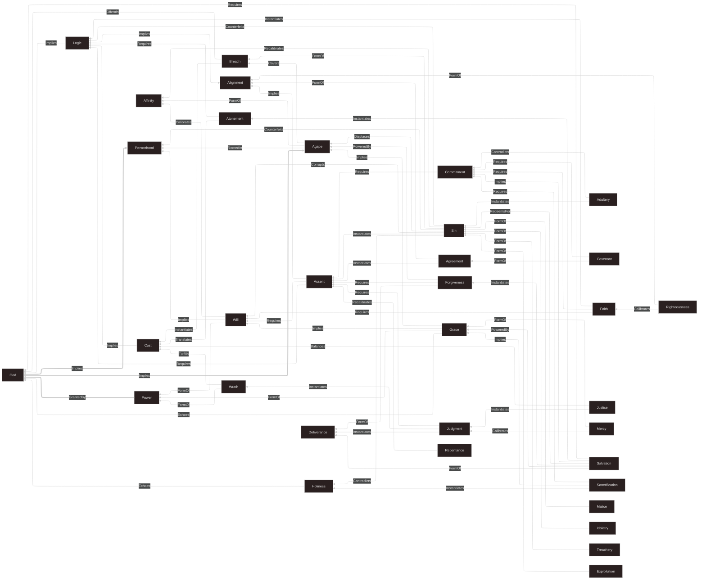

# Substrate Level Definition Network

```mermaid

---
config:
  layout: elk
  theme: neo-dark
---
flowchart RL

%% Substrate Level Definition Network
%% There's attempt to keep it in alphabetical order by from node. But this is done manually so results may vary :).
%% The substrate definitions are prior to the graph and the graph emerges from those definitions and their known contexts.
%% Specific morallity, named or higher order theology, or other system are not intended.  
%% Working to examine mechanics, margins and magesty allowig mystery except as a mask for mitigable muddle.

Adultery--Contradicts-->Commitment
Adultery--Instantiates-->Sin
Agape--FormOf-->Affinity
Agape--Covers-->Breach
Agape--RootedIn-->Personhood
Agape<==Implies==>God
Agreement--Instantiates-->Assent
Agreement--FormOf-->Alignment
Alignment<--Implies-->Logic
Atonement--Translates-->Cost
Atonement--Requires-->Logic
Assent--Requires-->Will
Assent--Requires-->Logic
Assent--Implies-->Alignment
Breach--Offends-->God
Breach--Instantiates-->Cost
Commitment--Requires-->Assent
Covenant--Requires-->Commitment
Covenant--FormOf-->Agreement
Cost--Implies-->Logic
Faith--Instantiates-->Logic
Faith--Requires-->Commitment
Faith--Requires-->Will
Forgiveness--Requires-->Assent
Forgiveness--FormOf-->Deliverance
Forgiveness--PoweredBy-->Agape
Grace--Echoes-->God
Grace--Implies-->Agape
Grace--Implies-->Will
Grace--FormOf-->Power
Holiness--Echoes-->God
Judgment--Requires-->Assent
Judgment--Instantiates-->Wrath
Judgment--Instantiates-->Deliverance
Justice--Instantiates-->Judgment
Justice--Balances-->Cost
Mercy--Calibrates-->Judgment
Logic--Implies-->God
Mercy--FormOf-->Grace
Personhood<==Implies==>God
Power==GrantedBy==>God
Repentance--Recalibrates-->Assent
Righteousness--FormOf-->Alignment
Righteousness--Calibrates-->Faith
Salvation--Instantiates-->Forgiveness
Salvation--Requires-->God
Salvation--Implies-->Commitment
Salvation--PoweredBy-->Grace
Salvation--RedeemsFor-->Sin
Salvation--FormOf-->Deliverance
Salvation--Instantiates-->Atonement
Sanctification--Implies-->Grace
Sanctification--Instantiates-->Holiness
Sanctification--Requires-->Commitment
Sin--Contradicts-->Holiness
Sin--Corrupts-->Will
Sin--Displaces-->Agape
Sin--Counterfeits-->Personhood
Sin--Counterfeits-->Logic
Sin--Instantiates-->Assent
Sin--Recalibrates-->Affinity
Sin--FormOf-->Breach
Will--Calibrates-->Affinity
Will--Implies-->Personhood
Will--FormOf-->Power
Malice--FormOf-->Sin
Idolatry--FormOf-->Sin
Treachery--FormOf-->Sin
Exploitation--FormOf-->Sin
Wrath--FormOf-->Power
Wrath--Fulfills-->Cost

```
